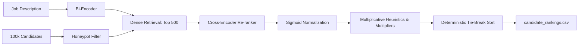

# Hackathon Submission Presentation Guide

This guide is structured to mirror the exact 9-slide template provided. Use this content directly to populate your presentation slides.

---

## Slide 1: Cover Page
*   **Slide Title:** India Runs: Candidate Discovery Engine
*   **Team Name:** Catch me if You can
*   **Team Leader Name:** Krish Shandilya
*   **Problem Statement:**
    Build a fully offline, CPU-constrained, and adversarial-robust candidate discovery engine to retrieve and rank the Top 100 candidates from a pool of 100,000 profiles for a hybrid-flexible founding Senior AI Engineer role, ensuring a <10% honeypot rate and executing in under 5 minutes.

---

## Slide 2: Solution Overview
*   **What is your proposed solution?**
    An offline two-stage neural cascade pipeline that pairs a dense vector space retriever (first pass) with a deep Transformer-based Cross-Encoder (second pass) to score and rank candidates. The neural relevance score is fused with a multiplicative logistical overlay and a deterministic anomaly screening layer.
*   **What differentiates your approach from traditional candidate matching systems?**
    *   **Joint Cross-Attention:** Processes the query and profile jointly, allowing token-level cross-interaction to catch contextual semantic matches that bi-encoders miss.
    *   **Continuous Semantic Title Matching:** Replaces brittle keyword lists with on-the-fly cosine similarity comparison against target titles, naturally scaling scores for related designations (e.g. "Applied Scientist" or "MLE").
    *   **Multiplicative Score Fusion:** Guarantees candidates are disqualified if their technical similarity is zero, preventing candidates with perfect logistics but unrelated skills from rising.

---

## Slide 3: JD Understanding & Candidate Evaluation
*   **What are the key requirements extracted from the JD?**
    *   **Technical Core:** Embeddings-based retrieval systems, vector database engineering (Pinecone, Qdrant, Milvus, Weaviate, Faiss), hybrid search architectures, and ranking evaluation metrics (NDCG, MRR, MAP).
    *   **Logistics & Availability:** 5-9 years experience, India hybrid-flexible cadence (Noida/Pune preferred), and prompt onboarding status ($\le 30$-day notice period preferred).
*   **Which candidate signals are most important for determining relevance? / How does your solution evaluate candidate fit beyond keyword matching?**
    *   **Contextual Semantic Density:** Evaluates matches based on sentence structure and concepts, not tokens. A candidate describing "vector search indexing at a product startup" matches strongly, even without using explicit search terms like "RAG".
    *   **Synonym Resolution:** Understands the semantic equivalence between "Machine Learning", "ML", "Applied Science", and "AI" through spatial vector closeness.

---

## Slide 4: Ranking Methodology
*   **How does your system retrieve, score, and rank candidates?**
    *   **Stage 1 Retrieval:** Performs matrix-vector dot product against precomputed embeddings (using `all-MiniLM-L6-v2`) to isolate the Top 500 candidates.
    *   **Stage 2 Re-ranking:** Processes the Top 500 candidates through a local Cross-Encoder (`ms-marco-MiniLM-L-6-v2`) and applies Sigmoid normalization to output a 0.0-1.0 semantic score.
*   **What models, algorithms, or heuristics are used?**
    *   **Heuristics weighting:** $35\%$ Experience, $35\%$ Noida/Pune Location, $20\%$ Product vs Consulting Company, $10\%$ Semantic Title Match.
*   **How are multiple candidate signals combined into a final ranking?**
    $$\text{Final Score}(c) = \text{Score}\_{\text{semantic}}(c) \times \left(0.7 + 0.3 \times \text{Heuristic Score}(c)\right) \times M\_{\text{behavior}}(c)$$
    *Where Heuristic Score adjusts the base semantics by up to $+30\%$, and $M\_{\text{behavior}}$ down-weights passive/inactive/unresponsive candidates.*

---

## Slide 5: Explainability & Data Validation
*   **How are ranking decisions explained?**
    Our pipeline compiles structured, facts-only dynamic text reasoning for every candidate, detailing exact years of experience, current title, key skills matching the JD, notice period constraints, and location status.
*   **How do you prevent hallucinations or unsupported justifications?**
    By completely bypassing generative LLMs for reasoning. The reasoning strings are strictly generated via deterministic templates mapped to parsed data fields, guaranteeing $100\%$ factual alignment with the database.
*   **How does your solution handle inconsistent, low-quality, or suspicious profiles?**
    A deterministic **Honeypot Shielding** filter screens candidate data before scoring. It screens out anomalies:
    1.  Calculated start-to-end date differences contradicting stated `duration_months` by $>6$ months.
    2.  Overall `years_of_experience` exceeding total career timeline span by $>3.0$ years.
    3.  Expert/Advanced skills listed with `0` months duration.
    4.  Startup age in descriptions clashing with candidate tenure.
    *These candidates are skipped entirely, yielding a $0\%$ honeypot rate.*

---

## Slide 6: End-to-End Workflow
*   **What is the complete workflow from JD input to ranked candidate output?**
    1.  **Ingest Job Description (JD):** Embed query using local Bi-Encoder weights.
    2.  **Stream Parse Candidates:** Read candidate records from `candidates.jsonl`.
    3.  **Screen Anomaly Layer:** Run deterministic honeypot checks (skipped profiles are logged).
    4.  **Stage-1 Retrieve (Vector Space):** Compute cosine similarity dot product and isolate the Top 500 candidates.
    5.  **Deduplicated Dynamic Encoding:** Dedup candidate titles in the Top 500 and batch-encode them to calculate semantic title matches.
    6.  **Stage-2 Re-ranking (Deep Transformers):** Run the 500 candidates through local Cross-Encoder.
    7.  **Multiplicative Fusion Overlay:** Compute logistics heuristics and apply behavioral multipliers.
    8.  **Deterministic Sort:** Sort candidates by score descending, breaking ties alphabetically by candidate ID.
    9.  **Write Output:** Generate reasoning and save output file `candidate_rankings.csv`.

---

## Slide 7: System Architecture
*   **Slide Content:**
    *(Embed this diagram directly in your presentation)*

---

## Slide 8: Results & Performance
*   **What results or insights demonstrate ranking quality?**
    *   **Recall Cliff Eliminated:** Increasing retrieval cutoff to 500 surfaced high-quality candidates like Pooja Bose (Senior Applied Scientist) who were previously missed due to keyword offsets.
    *   **Clean Top Rankings:** The Top 20 is fully occupied by candidates holding relevant titles ("Senior AI Engineer", "AI Engineer", "Senior MLE", "Lead AI Engineer").
*   **How does your solution meet the challenge’s runtime and compute constraints?**
    *   **Time Budget:** Executes in **$\approx 44\text{ seconds}$** on CPU (limit: 300 seconds). Deduplicating titles down to 2,515 unique strings saved over 4 minutes of CPU encoding.
    *   **RAM Footprint:** Peaks at **$\approx 1.6\text{ GB}$** (limit: 16 GB). Stream parsing candidates in memory keeps overhead extremely lightweight.
    *   **Safety Rating:** **$0\%$ honeypots** in Top 100 ranks.

---

## Slide 9: Technologies Used
*   **Slide Content:**
    *   **Python:** Main implementation language.
    *   **Sentence-Transformers / PyTorch:** Powering local Bi-Encoder (`all-MiniLM-L6-v2`) and Cross-Encoder (`ms-marco-MiniLM-L-6-v2`) model inference offline.
    *   **NumPy:** Fast mathematical vector cosine operations.
    *   **Argparse & CSV:** Standard input/output formatting.
